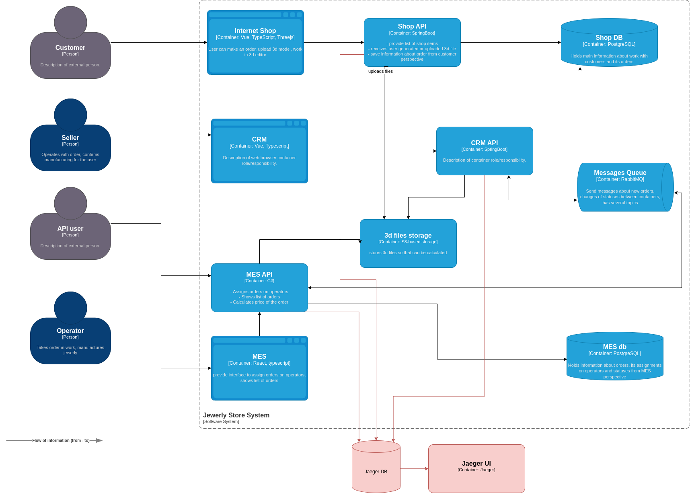

### Анализ
Заказ проходит через приложения MES API, CRM API, Shop API:
- В Shop API заказ может застрять при ошибке загрузки файла, ошибке при передаче заказа на расчет, при ошибке передачи данных в CRM
- В CRM API заказ может потеряться при ошибке создания заказа через MES API после расчета, при ошибке взаимодействия с хранилищем файлов
- В MES API заказ может потеряться при ошибке постановки в очередь на расчет, при ошибке расчета, при ошибке взаимодействия с хранилищем файлов

Данные, которые должны быть в трассировке:
- идентификатор заказа
- идентификатор подзапроса при повторных попытках
- название сервиса
- эндпоинт или имя функции, отражающие суть операции
- временные метки
- результат (код возврата, сообщение)
### Мотивация
Трейсинг позволит получить полную информацию о пути заказов, даже если в системе еще нет логирования. Будем знать время обработки на каждом этапе, поймем узкие места системы. И самое главное увидим где заказы пропадают. Благодаря этой информации можно:
 - уменьшить время обработки заказов убрав узкие места (например, путем масштабирования проблемных приложений)
 - исключить потерю заказов
 - уменьшить недовольство клиентов и повысить их удержание
 - повысить выручку компании
### Предлагаемое решение
Предлгаю использовать для реализации трейсинга платформу OpenTelemetry. А для визуализации трассировок - Jaeger.

Шаги:
- Разворачиваем Jaeger
- С помощью SDK платформы OpenTelemetry настраиваем в наших приложениях экспорт метрик в Jaeger

Схема:

### Компромиссы
Возможные проблемы с внедрением трейсинга:
- неполное покрытие не даст нужного эффекта
- слишком детальный трейсинг затруднит анализ информации
- сложность интеграции с проприетарными системами
### Безопасность
Для обеспечения безопасности можно принять следующие меры:
- внедрение аутентификации и авторизации
- межсервисная коммуникация через защищенные каналы
- регулярные обновления компонентов системы
