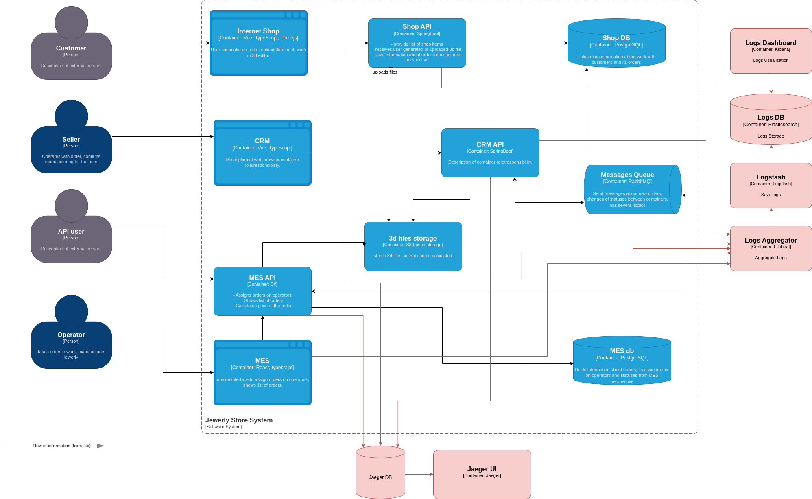

### Анализ
Предлагаю начать с логирования API приложний, подсистемы расчета MES и очереди сообщений
Уровень INFO:
- Логирование запросов к API: время, тип запроса, эндпоинт, код ответа
- Логирование изменения статуса заказа: время, id заказа, статус
- Логирование событий очереди: время, событие, id заказа
- Логирование начала и окончания расчета: время, событие, id заказа, статус
Уровень WARN:
 - Информация о повторных попытках запросов к API при неудачах: время, тип запроса, эндпоинт, код ответа, оставшееся число попыток
 Уровень ERROR:
  - Все ошибки доступа к приложениям и БД системы, когда все повторные попытки исчерпаны: время, тип запроса, эндпоинт, код ответа
  - Ошибки постановки в очередь: время, событие, id заказа, код ошибки, описание ошибки
  - Прочие ошибки приложений: на усмотрение разработчиков
  Уровень DEBUG:
  - Информация для отладки: на усмотрение разработчиков
### Мотивация
Внедрение логирования позволит собирать и анализировать данные о работе системы, а так же обнаруживать ошибки и причины их возникновения.
Логирование дополнит мониторинг и трейсинг, предоставляя больше деталей об ошибках. Это необходимо для завершения реализации концепции наблюдаемости нашей системы.
### Предлагаемое решение
Для реализации логирования предлагаю использовать стек ELK.
Для обеспечения безопасности будут приняты меры:
- аутентификация и авторизация
- доступ к логам будет только с определенных ip адресов
- нужно избегать хранения чувствительных данных в логах
- при необходимости хранения чувствительных данных они должны быть зашифрованы

Поскольку удобнее работать с небольшими индексами, то политика хранения будет следующая:
- для каждого сервиса будет отдельный индекс для логов на каждый день
- индексы будут храниться 30 дней
- по истечении 30 дней индексы будут переноситься на более дешёвый уровень хранения на 1 год, после чего могут быть удалены

Схема:

### Система анализа логов
Для превращения системы сбора логов в систему анализа логов для начала можно настроить следующие уведомления:
- Уведомление об аномальных попытках входа в систему
- Уведомление о превышении лимита ошибок в логах приложения за определенный период времени
- Уведомление о недоступности сервиса
- Уведомление о высокой загрузке CPU или памяти сервера
- Уведомление о резком увеличении трафика на сайт
