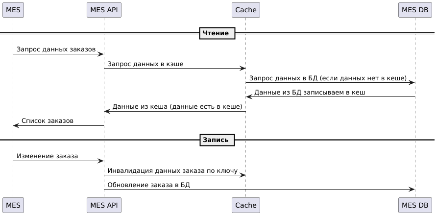

### Анализ
Для устранения проблем с загрузкой страницы заказов необходимо внедрить кеширование в MES
### Мотивация
Кеширование позволит:
- ускорить загрузку страницы с заказами
- возможность видеть все заказы и работать с фильтрами (сейчас это проблематично)
- снизить нагрузку на приложение MES
- сделать работу операторов комфортной и эффективной
### Предлагаемое решение
Предлагаю использовать серверное кеширование, поскольку информация о заказах одинакова для всех операторов, и нет смысла создавать копии этой информации в браузере каждого оператора. При серверном кешировании можно внедрить стратегию прогрева кеша перед запуском приложения, что даст быстрый доступ к информации сразу. При клиентском кешировании каждый оператор будет сталкиваться с задержкой загрузки при первом запросе.

Поскольку основная нагрузка - это операции чтения, предлагаю выбирать между паттернами Cache-Aside и Read-Through. Паттерн Refresh-ahead не будем рассматривать, т.к. в нашем случае преимуществ он не дает, но более сложен в реализации. Рассмотрим плюсы и минусы подходов для нашего случая.

Преимущества Cache-Aside:
 - Устойчивость к сбоям. В нашем случае это большой плюс. В случае отказа кеша система продолжить работать. В варианте Read-Through при отказе кеша данные будет брать неоткуда и мы получим ошибку.
 - Возможность прогрева кеша при запуске приложения. В варианте Read-Through мы всегда получим кеш-промах при первом запросе
 
Недостатки Cache-Aside:
 - Несогласованность данных в кеше с базой данных. В варианте Read-Through проще поддерживать свежесть данных, так как все запросы в БД идут через кеш.

В конечном счете предлагаю выбрать паттерн Cache-Aside, как более отказоустойчивый, хоть и чуть более сложный в реализации:
 - Для устранения несогласованности данных предлагаю применить стратегию инвалидации по ключу. Кеш инвалидируется только для заказа, статус которого изменился, по его uid.
- Так же на старте приложения производится запрос в БД обо всех заказах в работе для прогрева кеша.

Диаграмма последовательности действий:

